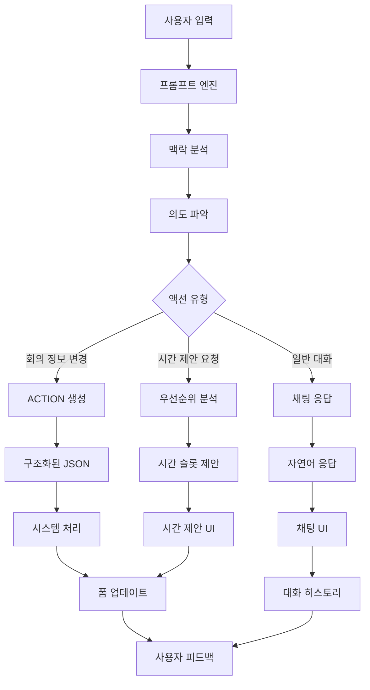
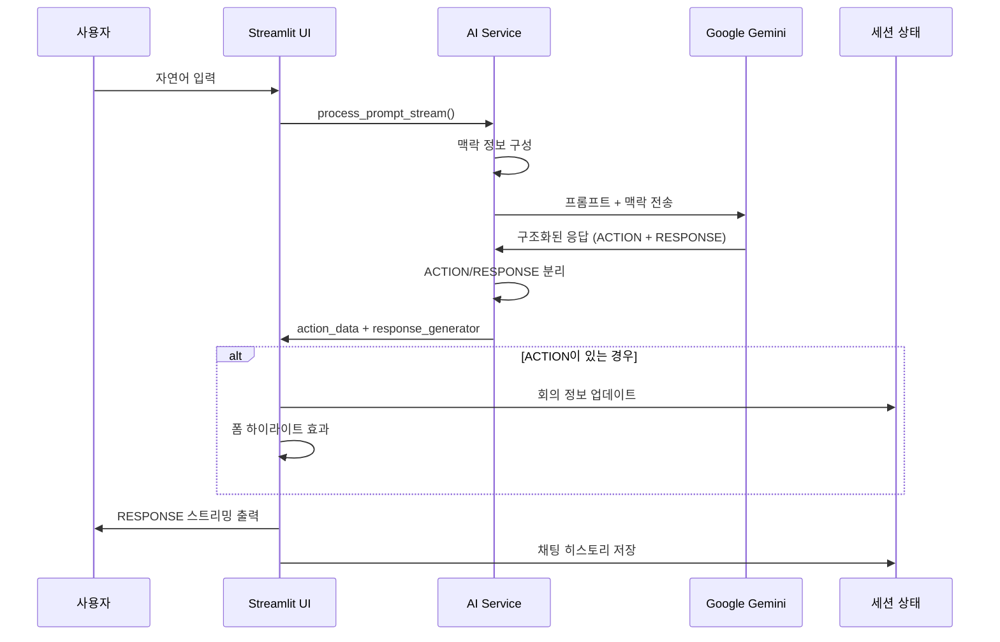
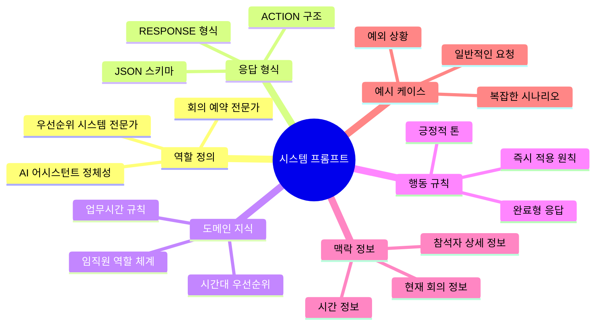
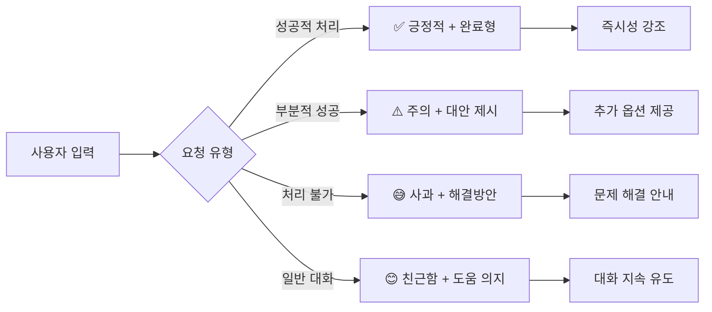
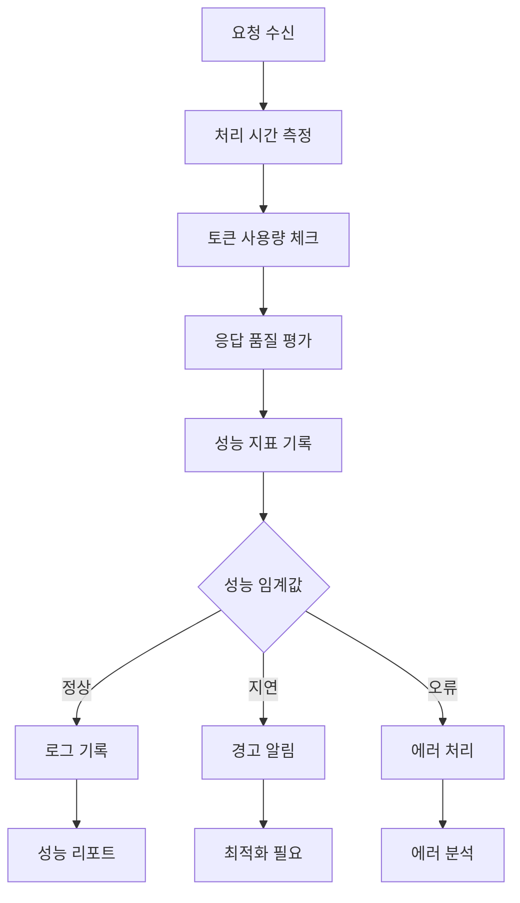

# AI 시스템 프롬프트 설계 전략 가이드

> 효과적인 AI 어시스턴트를 위한 프롬프트 엔지니어링 설계 문서

## 📋 목차

1. [개요](#개요)
2. [시스템 아키텍처](#시스템-아키텍처)
3. [프롬프트 설계 원칙](#프롬프트-설계-원칙)
4. [구조화된 응답 패턴](#구조화된-응답-패턴)
5. [실제 적용 사례](#실제-적용-사례)
6. [성능 최적화 전략](#성능-최적화-전략)
7. [문제 해결 가이드](#문제-해결-가이드)

---

## 개요

### 🎯 설계 목표

AI Meeting Booking System의 프롬프트 설계는 다음 목표를 달성하기 위해 개발되었습니다:

- **자연스러운 대화**: 사용자가 복잡한 명령어를 학습할 필요 없이 자연어로 소통
- **즉시 적용**: 확인 절차 없이 바로 회의 정보 업데이트
- **맥락 인식**: 현재 회의 정보와 참석자 역할을 고려한 지능적 응답
- **구조화된 출력**: ACTION과 RESPONSE를 분리하여 시스템과 사용자 각각에게 최적화

### 🏗️ 핵심 컴포넌트



---

## 시스템 아키텍처

### 🔄 프롬프트 처리 플로우



### 🧩 프롬프트 구성 요소



---

## 프롬프트 설계 원칙

### 1. 🎯 **명확한 역할 정의**

```markdown
당신은 회의 예약 시스템의 AI 어시스턴트입니다. 
임직원의 역할(임원/팀장/전문직/일반직)과 일정 우선순위를 고려하여 
최적의 회의 시간을 제안할 수 있습니다.
```

**설계 이유**: AI에게 명확한 정체성과 전문 영역을 부여하여 일관된 응답 보장

### 2. 📋 **구조화된 출력 강제**

```markdown
## 응답 형식
일정/회의 관련 요청이면 두 부분으로 나누어 응답:

ACTION:
{"action": "update", "updates": {"title": "값"}, "requires_confirmation": false}

RESPONSE:
✅ 회의 제목을 변경했습니다!
```

**설계 이유**: 시스템 처리와 사용자 응답을 분리하여 각각 최적화

### 3. 🔄 **즉시 적용 원칙**

```markdown
## 중요한 규칙
1. **즉시 적용**: requires_confirmation을 false로 설정하고 바로 적용
2. **완료형 응답**: "~했습니다" 완료형으로 작성
3. **긍정적 톤**: ✅ 이모지 활용한 친근한 응답
```

**설계 이유**: 사용자 경험 향상을 위한 즉시성과 명확한 피드백

### 4. 🧠 **맥락 인식 강화**

```markdown
## 현재 상황
현재 시간: {current_time}
{current_meeting}

참석자 상세 정보:
{attendee_context}
```

**설계 이유**: 동적 맥락 정보를 통한 상황별 최적 응답

### 5. 📝 **구체적인 예시 제공**

```markdown
## 응답 예시

### 회의 정보 변경 예시
사용자: "회의 제목을 '월간 보고서 검토'로 바꿔줘"
ACTION: 
{
  "action": "update", 
  "updates": {"title": "월간 보고서 검토"}, 
  "requires_confirmation": false
}
RESPONSE: 
✅ 회의 제목을 '월간 보고서 검토'로 변경했습니다!
```

**설계 이유**: 구체적인 예시를 통한 응답 품질 일관성 확보

---

## 구조화된 응답 패턴

### 🔧 ACTION 스키마 설계

```typescript
interface ActionSchema {
  action: "update" | "save" | "clear" | "chat" | "suggest_time";
  updates?: {
    title?: string;
    start_time?: string;  // "YYYY-MM-DD HH:MM"
    end_time?: string;    // "YYYY-MM-DD HH:MM"
    content?: string;
    attendees?: string;   // "김철수, 이영희, 박민수"
  };
  requires_confirmation: boolean;
  action_description: string;
}
```

### 💬 RESPONSE 패턴 라이브러리

#### **성공 응답 패턴**
```markdown
✅ {작업}을/를 {결과}했습니다!
✅ 회의 제목을 '팀 미팅'으로 변경했습니다!
✅ 내일 오후 2시로 시간을 설정했습니다!
✅ 김철수님을 참석자에 추가했습니다!
```

#### **시간 제안 응답 패턴**
```markdown
🎯 **추천 시간 순위:**

**1순위: {시간}**
- 점수: {점수}점
- 가용성: {가용성}%
- ✅ 충돌 없음

**2순위: {시간}**
- 점수: {점수}점  
- 가용성: {가용성}%
- ⚠️ 충돌: {충돌자}

💡 **{최적시간}**을 회의 시간으로 설정하시겠습니까?
```

#### **오류 응답 패턴**
```markdown
😅 죄송합니다. {문제상황}
다른 {대안}을/를 시도해보시겠어요?

🤔 {이유}로 인해 처리할 수 없습니다.
{해결방법}을 확인해주세요.
```

### 🎨 응답 톤 가이드라인



---

## 실제 적용 사례

### 🏢 **사례 1: 기본 회의 정보 변경**

#### 입력:
```
"회의 제목을 '개발팀 스프린트 계획'으로 바꿔줘"
```

#### 프롬프트 처리:
```markdown
1. 의도 파악: 회의 제목 변경
2. 액션 타입: update
3. 필요 정보: title 업데이트
4. 확인 필요성: 불필요 (단순 정보 변경)
```

#### 시스템 응답:
```
ACTION:
{
  "action": "update",
  "updates": {"title": "개발팀 스프린트 계획"},
  "requires_confirmation": false,
  "action_description": "회의 제목을 '개발팀 스프린트 계획'으로 변경했습니다"
}

RESPONSE:
✅ 회의 제목을 '개발팀 스프린트 계획'으로 변경했습니다!
```

### ⏰ **사례 2: 복합 정보 변경**

#### 입력:
```
"내일 오후 3시에 김철수, 이영희와 함께 기획 회의로 변경해줘"
```

#### 프롬프트 처리:
```markdown
1. 의도 파악: 시간, 참석자, 제목 모두 변경
2. 시간 파싱: "내일 오후 3시" → "2025-06-16 15:00"
3. 참석자 파싱: "김철수, 이영희" → 참석자 문자열
4. 제목 설정: "기획 회의"
```

#### 시스템 응답:
```
ACTION:
{
  "action": "update",
  "updates": {
    "title": "기획 회의",
    "start_time": "2025-06-16 15:00",
    "attendees": "김철수, 이영희"
  },
  "requires_confirmation": false,
  "action_description": "내일 오후 3시에 김철수, 이영희와 함께 기획 회의로 설정했습니다"
}

RESPONSE:
✅ 내일 오후 3시에 김철수, 이영희와 함께 기획 회의로 설정했습니다!
```

### 🎯 **사례 3: 시간 제안 요청**

#### 입력:
```
"다음 주 수요일에 임원진과 개발팀 전략 회의 적절한 시간 제안해줘"
```

#### 프롬프트 처리:
```markdown
1. 키워드 감지: "적절한 시간 제안" → 시간 제안 요청
2. 날짜 파싱: "다음 주 수요일" → 목표 날짜 계산
3. 참석자 분석: 임원진 + 개발팀 → 높은 우선순위
4. 우선순위 서비스 호출: suggest_meeting_times()
```

#### 시스템 응답:
```
ACTION:
{
  "action": "suggest_time",
  "updates": {
    "start_time": "2025-06-18 10:00",
    "end_time": "2025-06-18 11:30"
  },
  "requires_confirmation": true,
  "action_description": "최적 시간인 6월 18일 10시-11시 30분을 제안합니다"
}

RESPONSE:
🎯 **추천 시간 순위:**

**1순위: 06/18 10:00 - 11:30**
- 점수: 92.5점
- 가용성: 100%
- ✅ 충돌 없음

**2순위: 06/18 15:00 - 16:30**
- 점수: 89.1점
- 가용성: 85%
- ⚠️ 충돌: 1명

💡 **06/18 10:00**을 회의 시간으로 설정하시겠습니까?
```

### 💬 **사례 4: 일반 대화**

#### 입력:
```
"오늘 날씨 어때?"
```

#### 시스템 응답:
```
ACTION:
{
  "action": "chat"
}

RESPONSE:
안녕하세요! 저는 회의 예약을 도와드리는 AI 어시스턴트입니다. 
날씨 정보는 제공할 수 없지만, 회의 일정 관리는 언제든 도와드릴 수 있어요! 
새로운 회의를 예약하거나 기존 회의를 수정하고 싶으시면 말씀해주세요. 😊
```

---

## 성능 최적화 전략

### 🚀 **응답 속도 최적화**

#### 1. **프롬프트 길이 최적화**
```markdown
❌ 잘못된 예시: 3000+ 토큰의 긴 프롬프트
✅ 올바른 예시: 1500 토큰 이하의 핵심 정보만 포함

핵심 전략:
- 불필요한 예시 제거
- 중복 설명 통합
- 동적 맥락 정보만 포함
```

#### 2. **스트리밍 최적화**
```python
def response_generator():
    import time
    if response_text:
        words = response_text.split()
        for word in words:
            yield word + " "
            time.sleep(0.05)  # 최적 타이핑 속도
```

#### 3. **캐싱 전략**
```python
@lru_cache(maxsize=100)
def get_employee_context(attendee_ids: tuple) -> str:
    """참석자 정보 캐싱"""
    # 자주 조회되는 참석자 정보 캐시
```

### 🎯 **정확도 향상**

#### 1. **맥락 정보 최적화**
```python
def _get_meeting_context(self, meeting: Meeting) -> str:
    """현재 회의 컨텍스트 생성"""
    # 필요한 정보만 선별적으로 포함
    return f"""
현재 회의:
- 제목: {meeting.title}
- 시간: {meeting.get_formatted_start_time()} - {meeting.get_formatted_end_time()}
- 참석자: {len(meeting.attendees)}명
- 모드: {'수정' if meeting.is_edit_mode else '신규'}
"""
```

#### 2. **의도 파악 강화**
```markdown
## 키워드 매핑
시간 제안: ["적절한 시간", "시간 제안", "언제가 좋", "빈 시간", "가능한 시간"]
정보 변경: ["바꿔", "변경", "수정", "설정"]
참석자 관리: ["추가", "제거", "삭제", "초대"]
```

### 📊 **성능 모니터링**



---

## 문제 해결 가이드

### 🐛 **일반적인 문제들**

#### 1. **JSON 파싱 오류**

**문제**: AI가 잘못된 JSON 형식으로 응답
```
// 잘못된 형식
{"action": "update", "updates": {"title": "회의"}}  // 마지막 컴마

// 올바른 형식  
{"action": "update", "updates": {"title": "회의"}}
```

**해결책**: 
```python
def _extract_json(self, text: str) -> Optional[str]:
    """JSON 추출 시 오류 처리 강화"""
    json_patterns = [
        r'```json\n(.*?)\n```',
        r'```\n(.*?)\n```', 
        r'\{.*?\}'
    ]
    
    for pattern in json_patterns:
        match = re.search(pattern, text, re.DOTALL)
        if match:
            try:
                # JSON 유효성 검사
                json.loads(match.group(1))
                return match.group(1)
            except json.JSONDecodeError:
                continue
    return None
```

#### 2. **시간 파싱 오류**

**문제**: "내일 오후 2시" 같은 자연어 시간 인식 실패

**해결책**:
```python
def _extract_target_date(self, prompt: str) -> Optional[datetime]:
    """자연어 시간 파싱 강화"""
    now = datetime.now()
    
    # 패턴 매칭 강화
    patterns = {
        r'내일': timedelta(days=1),
        r'모레': timedelta(days=2),
        r'다음\s*주': timedelta(weeks=1),
        r'다음\s*달': timedelta(days=30)
    }
    
    for pattern, delta in patterns.items():
        if re.search(pattern, prompt):
            return now + delta
    
    return None
```

#### 3. **맥락 정보 누락**

**문제**: 참석자 정보 없이 시간 제안 요청

**해결책**:
```python
def _handle_schedule_suggestion(self, prompt: str, current_meeting: Meeting):
    """시간 제안 처리 시 유효성 검사"""
    if not current_meeting.attendees:
        def error_generator():
            yield "😅 시간 제안을 위해서는 먼저 참석자를 추가해주세요!"
        return None, error_generator()
    
    # 정상 처리 로직...
```

### 🔧 **디버깅 도구**

#### 1. **프롬프트 디버깅**
```python
def debug_prompt(self, prompt: str, meeting: Meeting) -> str:
    """프롬프트 디버깅용 메서드"""
    full_prompt = self._build_full_prompt(prompt, meeting)
    
    print("=" * 50)
    print("DEBUG: Full Prompt")
    print("=" * 50)
    print(full_prompt)
    print("=" * 50)
    
    return full_prompt
```

#### 2. **응답 분석**
```python
def analyze_response(self, response: str) -> dict:
    """응답 분석 도구"""
    return {
        "has_action": "ACTION:" in response,
        "has_response": "RESPONSE:" in response,
        "json_valid": self._is_valid_json(response),
        "token_count": len(response.split()),
        "response_type": self._classify_response(response)
    }
```

### 📈 **성능 최적화 체크리스트**

```markdown
## 프롬프트 최적화 체크리스트

### 🔍 구조
- [ ] 역할 정의가 명확한가?
- [ ] 응답 형식이 구체적인가?
- [ ] 예시가 충분한가?
- [ ] 불필요한 내용은 없는가?

### ⚡ 성능
- [ ] 토큰 수가 1500개 이하인가?
- [ ] 스트리밍이 자연스러운가?
- [ ] 캐싱이 적용되었는가?
- [ ] 오류 처리가 포함되었는가?

### 🎯 정확도
- [ ] 의도 파악이 정확한가?
- [ ] 맥락 정보가 충분한가?
- [ ] JSON 형식이 일관된가?
- [ ] 시간 파싱이 정확한가?

### 👤 사용자 경험
- [ ] 응답이 친근한가?
- [ ] 피드백이 즉시적인가?
- [ ] 오류 메시지가 도움이 되는가?
- [ ] 예외 상황 처리가 우아한가?
```

---

## 결론

### 🎯 **핵심 성공 요소**

1. **구조화된 설계**: ACTION/RESPONSE 분리로 시스템과 사용자 모두 만족
2. **맥락 인식**: 동적 정보 주입으로 상황별 최적 응답
3. **즉시성**: 확인 절차 제거로 매끄러운 사용자 경험
4. **확장성**: 모듈화된 구조로 새로운 기능 추가 용이

### 🚀 **향후 발전 방향**

- **개인화**: 사용자별 선호도 학습
- **다국어**: 글로벌 서비스를 위한 다국어 지원
- **음성**: 음성 인터페이스 통합
- **예측**: 사용자 패턴 기반 사전 제안

### 💡 **개발팀을 위한 팁**

```markdown
1. 🧪 **반복 테스트**: 다양한 시나리오로 지속적 검증
2. 📊 **데이터 수집**: 실제 사용 패턴 분석으로 개선점 파악
3. 🔄 **점진적 개선**: 한 번에 모든 것을 완벽하게 하려 하지 말 것
4. 👥 **사용자 피드백**: 실제 사용자의 의견을 적극 반영
```

---

*이 문서는 AI Meeting Booking System의 프롬프트 설계 경험을 바탕으로 작성되었으며,  
다른 AI 어시스턴트 개발 프로젝트에도 적용 가능한 일반적인 원칙들을 포함하고 있습니다.*