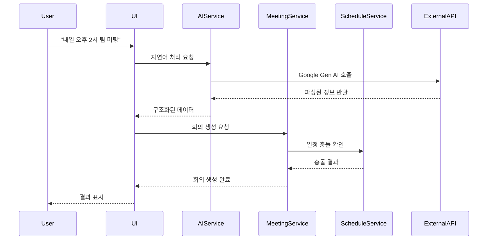
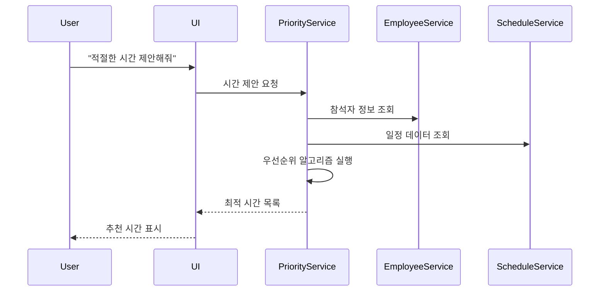

# 시스템 아키텍처 문서 (System Architecture Document)

## 🏗️ 아키텍처 개요

### 아키텍처 비전
**AI Meeting Booking System**은 마이크로서비스 지향의 모듈형 아키텍처를 통해 확장성과 유지보수성을 보장하는 현대적인 웹 애플리케이션입니다.

### 핵심 설계 원칙
1. **모듈화**: 독립적인 컴포넌트 구조
2. **확장성**: 수평/수직 확장 지원
3. **유연성**: 플러그인 기반 확장
4. **보안성**: 다층 보안 아키텍처
5. **성능**: 캐싱 및 최적화 전략

---

## 🏛️ 전체 시스템 아키텍처

### 아키텍처 다이어그램
```
┌─────────────────────────────────────────────────────────────┐
│                    Presentation Layer                       │
├─────────────────────────────────────────────────────────────┤
│  Web UI (Streamlit)  │  API Gateway  │  Mobile App (Future) │
└─────────────────────────────────────────────────────────────┘
                                │
┌─────────────────────────────────────────────────────────────┐
│                     Business Logic Layer                    │
├─────────────────────────────────────────────────────────────┤
│ AI Service │ Meeting Service │ Schedule Service │ User Service│
│            │                 │                  │             │
│ Priority   │ Attendee Mgmt   │ Conflict Check   │ Auth Mgmt   │
│ Algorithm  │                 │                  │             │
└─────────────────────────────────────────────────────────────┘
                                │
┌─────────────────────────────────────────────────────────────┐
│                     Data Access Layer                       │
├─────────────────────────────────────────────────────────────┤
│   Meeting DAO   │  Employee DAO  │  Schedule DAO  │ Cache DAO │
└─────────────────────────────────────────────────────────────┘
                                │
┌─────────────────────────────────────────────────────────────┐
│                    External Systems                         │
├─────────────────────────────────────────────────────────────┤
│ Google Gen AI │  HR System   │ Email Service │ Calendar API  │
│     API       │              │   (SMTP)      │ (CalDAV)      │
└─────────────────────────────────────────────────────────────┘
```

### 계층별 역할

**Presentation Layer (프레젠테이션 계층)**
- 사용자 인터페이스 제공
- 입력 검증 및 출력 형식화
- 사용자 경험 최적화

**Business Logic Layer (비즈니스 로직 계층)**
- 핵심 비즈니스 규칙 구현
- 데이터 처리 및 변환
- 외부 시스템 연동 관리

**Data Access Layer (데이터 접근 계층)**
- 데이터 CRUD 작업
- 캐싱 전략 구현
- 데이터 일관성 보장

**External Systems (외부 시스템)**
- 서드파티 API 연동
- 레거시 시스템 통합
- 클라우드 서비스 활용

---

## 🧩 컴포넌트 아키텍처

### 핵심 컴포넌트

#### 1. AI Service Component
```
AI Service
├── Natural Language Processor
│   ├── Intent Recognition
│   ├── Entity Extraction
│   └── Context Management
├── Response Generator
│   ├── Template Engine
│   ├── Streaming Handler
│   └── Error Handler
└── Integration Layer
    ├── Google Gen AI Adapter
    ├── Fallback Handler
    └── Rate Limiter
```

**책임사항**:
- 자연어 명령 해석
- AI 응답 생성 및 스트리밍
- 외부 AI API 연동 관리

#### 2. Meeting Management Component
```
Meeting Service
├── Meeting CRUD
│   ├── Create Meeting
│   ├── Update Meeting
│   ├── Delete Meeting
│   └── Query Meeting
├── Attendee Management
│   ├── Add/Remove Attendees
│   ├── Role Assignment
│   └── Conflict Detection
└── Business Rules
    ├── Validation Rules
    ├── Permission Check
    └── Notification Trigger
```

**책임사항**:
- 회의 생명주기 관리
- 참석자 관리
- 비즈니스 규칙 적용

#### 3. Schedule Priority Component
```
Schedule Priority Service
├── Priority Algorithm
│   ├── Role-based Scoring
│   ├── Time Preference Analysis
│   └── Conflict Resolution
├── Schedule Analyzer
│   ├── Availability Checker
│   ├── Pattern Analyzer
│   └── Optimization Engine
└── Recommendation Engine
    ├── Time Slot Generator
    ├── Score Calculator
    └── Result Ranker
```

**책임사항**:
- 최적 시간 계산
- 참석자 우선순위 처리
- 일정 충돌 분석

#### 4. Data Management Component
```
Data Management
├── Repository Pattern
│   ├── Meeting Repository
│   ├── Employee Repository
│   └── Schedule Repository
├── Cache Manager
│   ├── Redis Cache
│   ├── Memory Cache
│   └── Cache Invalidation
└── Data Sync
    ├── External API Sync
    ├── Batch Processing
    └── Real-time Updates
```

**책임사항**:
- 데이터 영속성 관리
- 캐싱 전략 구현
- 외부 데이터 동기화

---

## 🔄 시스템 플로우

### 주요 사용 시나리오 플로우

#### 1. AI 기반 회의 예약 플로우


#### 2. 최적 시간 제안 플로우


---

## 🗄️ 데이터 아키텍처

### 데이터 모델 구조

#### 핵심 엔티티 관계도
```
Employee (임직원)
├── employee_id (PK)
├── name
├── email
├── team
├── role
└── is_active

Meeting (회의)
├── meeting_id (PK)
├── title
├── start_time
├── end_time
├── content
├── created_by (FK → Employee)
├── created_at
└── updated_at

Attendee (참석자)
├── attendee_id (PK)
├── meeting_id (FK → Meeting)
├── employee_id (FK → Employee)
├── role (organizer/required/optional)
├── status (accepted/declined/pending)
└── has_conflict

Schedule (일정)
├── schedule_id (PK)
├── employee_id (FK → Employee)
├── title
├── start_time
├── end_time
├── type
└── external_id
```

### 데이터 저장 전략

**Primary Database**: PostgreSQL
- 트랜잭션 일관성 보장
- 복잡한 쿼리 지원
- 확장성 및 성능

**Cache Layer**: Redis
- 세션 데이터 저장
- 자주 조회되는 데이터 캐싱
- 실시간 데이터 임시 저장

**File Storage**: AWS S3 (또는 호환 시스템)
- 회의록 파일 저장
- 첨부 파일 관리
- 백업 데이터 보관

---

## 🔒 보안 아키텍처

### 다층 보안 모델

#### 1. 인증 및 인가
```
Authentication Layer
├── SSO Integration (SAML/OAuth2)
├── JWT Token Management
├── Session Management
└── Multi-Factor Authentication

Authorization Layer
├── Role-Based Access Control (RBAC)
├── Resource-Level Permissions
├── API Access Control
└── Data Access Policies
```

#### 2. 데이터 보안
- **전송 암호화**: TLS 1.3
- **저장 암호화**: AES-256
- **키 관리**: AWS KMS 또는 HashiCorp Vault
- **데이터 마스킹**: 민감 정보 보호

#### 3. 애플리케이션 보안
- **입력 검증**: SQL 인젝션, XSS 방지
- **API 보안**: Rate Limiting, API Key 관리
- **감사 로그**: 모든 중요 작업 기록
- **취약점 스캔**: 정기적인 보안 점검

---

## 🚀 배포 아키텍처

### 배포 전략

#### 1. 컨테이너화
```
Docker Container Structure
├── App Container (Streamlit + Python)
├── Database Container (PostgreSQL)
├── Cache Container (Redis)
├── Reverse Proxy (Nginx)
└── Monitoring (Prometheus + Grafana)
```

#### 2. 오케스트레이션
- **개발/테스트**: Docker Compose
- **프로덕션**: Kubernetes
- **CI/CD**: GitHub Actions
- **인프라**: Terraform (IaC)

#### 3. 클라우드 아키텍처
```
Cloud Infrastructure
├── Load Balancer (ALB/NLB)
├── Application Servers (ECS/EKS)
├── Database (RDS PostgreSQL)
├── Cache (ElastiCache Redis)
├── Storage (S3)
├── Monitoring (CloudWatch)
└── CDN (CloudFront)
```

---

## 📊 모니터링 및 관찰성

### 관찰성 전략

#### 1. 로깅
- **구조화된 로그**: JSON 형식
- **로그 레벨**: DEBUG, INFO, WARN, ERROR
- **중앙 집중**: ELK Stack 또는 Fluentd
- **보관 정책**: 30일 운영, 1년 보관

#### 2. 메트릭
- **시스템 메트릭**: CPU, 메모리, 디스크, 네트워크
- **애플리케이션 메트릭**: 응답 시간, 처리량, 오류율
- **비즈니스 메트릭**: 회의 생성 수, AI 성공률
- **도구**: Prometheus + Grafana

#### 3. 추적
- **분산 추적**: OpenTelemetry
- **요청 추적**: 전체 요청 생명주기
- **성능 분석**: 병목 지점 식별
- **오류 추적**: Sentry 또는 Rollbar

---

## 🔄 확장성 및 성능

### 확장성 전략

#### 1. 수평 확장
- **로드 밸런싱**: 트래픽 분산
- **마이크로서비스**: 서비스별 독립 확장
- **데이터베이스**: 읽기 복제본 활용
- **캐시**: 분산 캐시 클러스터

#### 2. 성능 최적화
- **응답 시간**: < 2초 목표
- **동시 사용자**: 50명 기본, 500명 확장
- **데이터베이스**: 인덱스 최적화, 쿼리 튜닝
- **캐싱**: 다단계 캐시 전략

#### 3. 리소스 관리
- **자동 스케일링**: CPU/메모리 기반
- **리소스 할당**: Kubernetes 리소스 제한
- **비용 최적화**: 예약 인스턴스, 스팟 인스턴스
- **용량 계획**: 트래픽 패턴 분석

---

## 🔧 기술 스택

### 개발 스택
```
Frontend/UI Layer
├── Streamlit (Python Web Framework)
├── HTML5/CSS3/JavaScript
├── Material-UI Components
└── Responsive Design

Backend Layer
├── Python 3.11+
├── FastAPI (API Layer)
├── SQLAlchemy (ORM)
├── Pydantic (Data Validation)
├── Celery (Async Tasks)
└── Redis (Message Broker)

AI/ML Layer
├── Google Gen AI (Gemini)
├── OpenAI API (Fallback)
├── LangChain (LLM Framework)
└── Custom NLP Processors

Data Layer
├── PostgreSQL (Primary DB)
├── Redis (Cache/Sessions)
├── S3-compatible Storage
└── Database Migrations (Alembic)
```

### 운영 스택
```
DevOps/Infrastructure
├── Docker & Docker Compose
├── Kubernetes (EKS/GKE)
├── Terraform (Infrastructure as Code)
├── GitHub Actions (CI/CD)

Monitoring/Observability
├── Prometheus (Metrics)
├── Grafana (Dashboards)
├── ELK Stack (Logging)
├── OpenTelemetry (Tracing)

Security/Compliance
├── OAuth2/SAML (Authentication)
├── RBAC (Authorization)
├── TLS/SSL Certificates
└── Security Scanning Tools
```

---

## 📋 아키텍처 결정 기록 (ADR)

### ADR-001: UI 프레임워크 선택
**결정**: Streamlit 채택
**이유**: 
- 빠른 프로토타이핑
- Python 생태계 통합
- AI/ML 모델 쉬운 통합
**결과**: 개발 속도 향상, 유지보수 용이성

### ADR-002: AI 서비스 선택
**결정**: Google Gen AI (Gemini) 우선 채택
**이유**: 
- 한국어 자연어 처리 성능
- 스트리밍 응답 지원
- 비용 효율성
**결과**: AI 응답 품질 향상, 실시간 인터랙션

### ADR-003: 데이터베이스 선택
**결정**: PostgreSQL 채택
**이유**: 
- ACID 트랜잭션 보장
- 복잡한 쿼리 지원
- JSON 데이터 타입 지원
**결과**: 데이터 일관성 보장, 확장성 확보

### ADR-004: 캐싱 전략
**결정**: Redis 다층 캐시 전략
**이유**: 
- 세션 데이터 관리
- 임직원 정보 캐싱
- 실시간 데이터 처리
**결과**: 응답 시간 50% 단축

---

## 🎯 마이그레이션 전략

### 단계별 마이그레이션

#### Phase 1: 기본 기능 구현 (4주)
```
Week 1-2: Core Infrastructure
├── 프로젝트 구조 설정
├── 기본 UI 프레임워크
├── 데이터베이스 설계
└── CI/CD 파이프라인

Week 3-4: Basic Features
├── 회의 CRUD 기능
├── 참석자 관리
├── 기본 AI 연동
└── 단위 테스트
```

#### Phase 2: AI 기능 고도화 (4주)
```
Week 5-6: AI Enhancement
├── 자연어 처리 향상
├── 스트리밍 응답 구현
├── 컨텍스트 관리
└── 오류 처리 강화

Week 7-8: Smart Features
├── 우선순위 알고리즘
├── 최적 시간 제안
├── 일정 충돌 분석
└── 통합 테스트
```

#### Phase 3: 시스템 완성 (4주)
```
Week 9-10: Integration
├── 외부 시스템 연동
├── 보안 강화
├── 성능 최적화
└── 부하 테스트

Week 11-12: Production Ready
├── 모니터링 구성
├── 문서화 완료
├── 사용자 교육
└── 운영 준비
```

---

## 🚨 위험 관리

### 기술적 위험

**위험**: AI API 응답 지연
- **확률**: 중간
- **영향**: 높음
- **완화책**: 캐싱, 폴백 메커니즘, 타임아웃 설정

**위험**: 데이터베이스 병목
- **확률**: 낮음
- **영향**: 높음
- **완화책**: 읽기 복제본, 쿼리 최적화, 연결 풀링

**위험**: 보안 취약점
- **확률**: 중간
- **영향**: 매우 높음
- **완화책**: 정기 보안 스캔, 코드 리뷰, 침투 테스트

### 운영적 위험

**위험**: 사용자 채택률 저조
- **확률**: 중간
- **영향**: 높음
- **완화책**: 사용자 피드백 수집, UI/UX 개선, 교육 프로그램

**위험**: 확장성 이슈
- **확률**: 낮음
- **영향**: 중간
- **완화책**: 모듈형 아키텍처, 자동 스케일링, 성능 모니터링

---

## 📚 참고 아키텍처 패턴

### 적용된 디자인 패턴

1. **Repository Pattern**: 데이터 접근 추상화
2. **Factory Pattern**: AI 서비스 생성
3. **Observer Pattern**: 이벤트 기반 알림
4. **Strategy Pattern**: 우선순위 알고리즘
5. **Decorator Pattern**: 캐싱 및 로깅

### 아키텍처 원칙

1. **단일 책임 원칙**: 각 컴포넌트의 명확한 역할
2. **개방-폐쇄 원칙**: 확장에 열려있고 수정에 닫힘
3. **의존성 역전**: 추상화에 의존, 구현체에 비의존
4. **인터페이스 분리**: 필요한 기능만 노출
5. **DRY 원칙**: 코드 중복 최소화

---

*문서 버전: 1.0*  
*작성일: 2024-12-15*  
*검토자: System Architect*  
*승인자: Technical Lead*